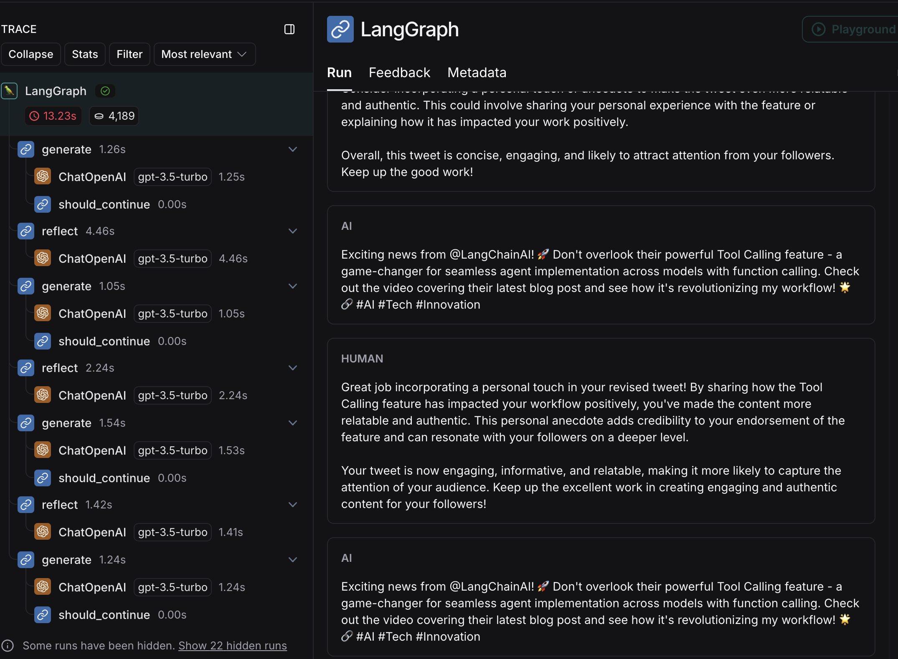

# LangGraph-reflection-agent-example
Sandbox for LangGraph. In this example, LangGraph used to constantly improved a tweet 

## setup
- install dependencies
`pip3 install -r requirements.txt`
- set .env file with api key of supported llm
```ini
MISTRAL_API_KEY=S0m#-Ap1_K#y-F0r_MiStR@L
OPENAI_API_KEY=S0m#-Ap1_K#y-F0r_OPENAI
LANGCHAIN_API_KEY=S0m#-Ap1_K#y-F0r_LANGCHAIN
LANGCHAIN_TRACING_V2=true
LANGCHAIN_ENDPOINT=https://api.smith.langchain.com
LANGCHAIN_PROJECT=reflection agent
```
- set tweet and should_continue rule in [`main.py`](main.py)

```python
def should_continue(state: List[BaseMessage]) -> bool:
    if len(state) > 6:
        return END
    return REFLECT
    # ...


if __name__ == "__main__":
    inputs = HumanMessage(content="""Make this tweet better:
        @LangChainAI
        - newly Tool Calling feature is seriously underrated.
         
         After a long wait, it's  here - making the implementation of agents across different models with function calling - super easy.
         
         Made a video covering their newest blog post""")
```

## execute
`python3 main.py`

## check output in LangSmith
